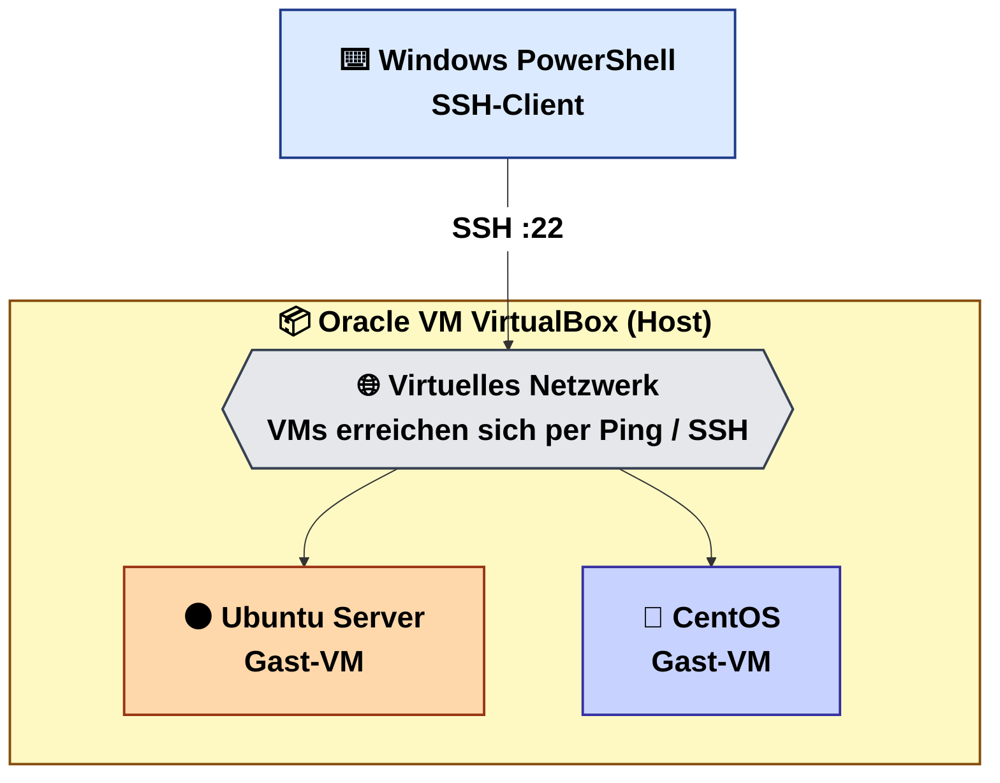
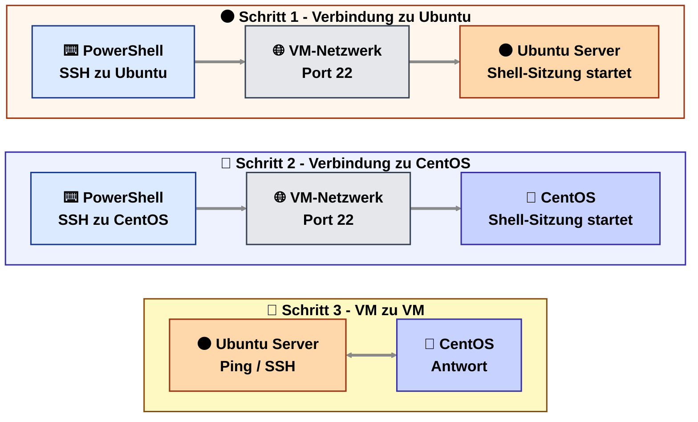
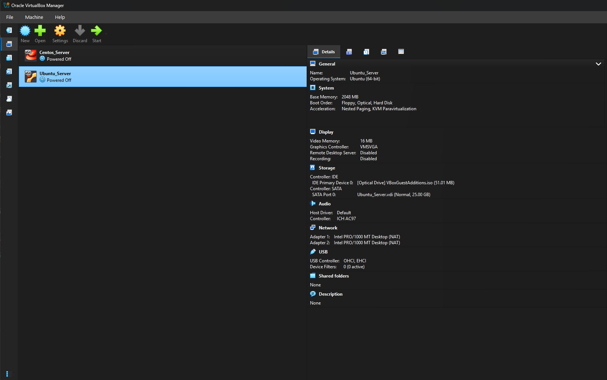
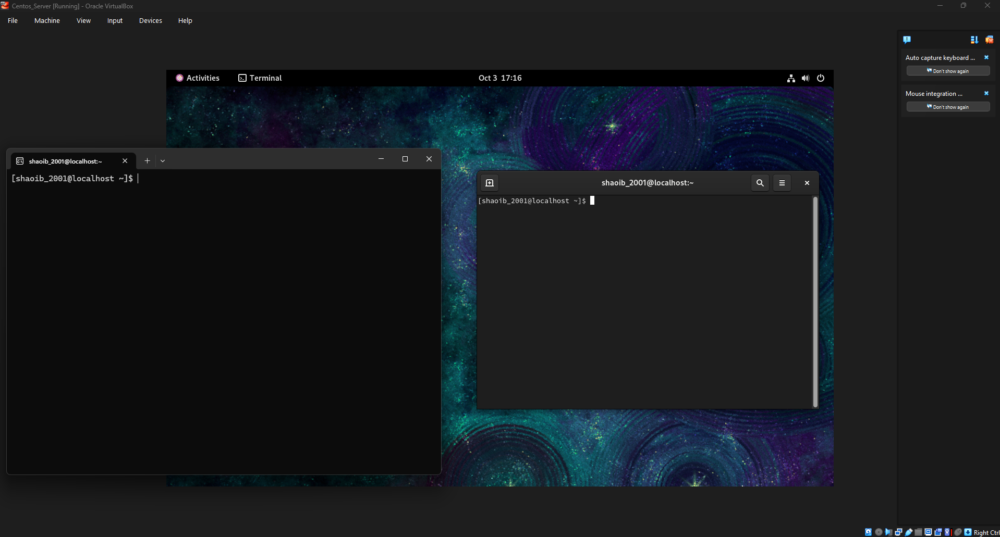
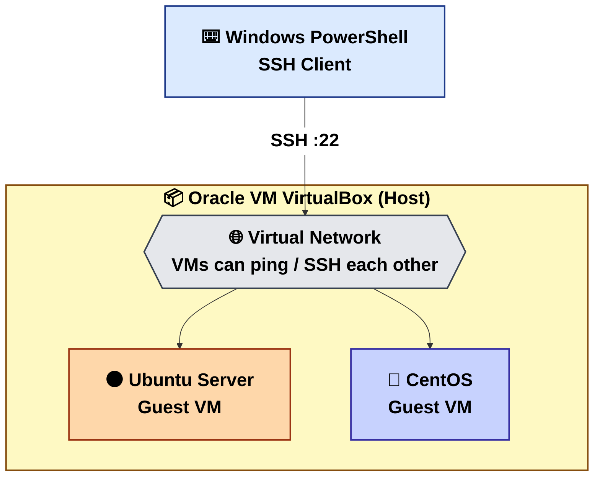
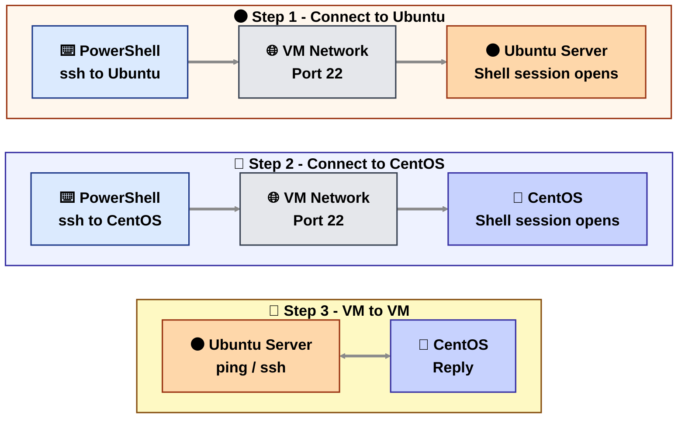

# Homelab

Sprache wählen / Choose a language

<details open name="language">
<summary><b>Deutsch</b></summary>

Ich betreibe virtuelle Maschinen mit Ubuntu Server und CentOS in Oracle VirtualBox und verwalte sie von Windows PowerShell aus per SSH. In diesem Homelab übe ich Linux-Administration, Netzwerktechnik und Fernwartung.

## Architekturdiagramm



## Wie alles verbunden ist



## Komponenten

| Komponente | Rolle | Details |
|---|---|---|
| Oracle VM VirtualBox | Host / Hypervisor | Führt die virtuellen Maschinen aus und isoliert sie |
| Ubuntu Server | Gast-VM 1 | Server der Debian-Familie (`apt`) |
| CentOS | Gast-VM 2 | Server der RHEL-Familie (`yum` / `dnf`) |
| Windows PowerShell | Verwaltungs-Client | Verbindet sich per SSH mit beiden VMs |

## Netzwerkaufbau

| Rechner | Hostname | IP-Adresse | Netzwerkmodus | Zugriff |
|---|---|---|---|---|
| Windows PowerShell (Client) | `my-pc` | `192.168.56.1` | Host-Only-Adapter | entfällt |
| Ubuntu Server | `ubuntu-server` | `192.168.56.101` | Host-Only / NAT | SSH (22) |
| CentOS | `centos-server` | `192.168.56.102` | Host-Only / NAT | SSH (22) |

## Kurzanleitung

Verbindung von PowerShell zu Ubuntu:

```powershell
ssh username@192.168.56.101
```

Verbindung von PowerShell zu CentOS:

```powershell
ssh username@192.168.56.102
```

Verbindung zwischen den beiden VMs prüfen (innerhalb von Ubuntu ausführen):

```bash
ping 192.168.56.102
```

SSH bei Bedarf installieren und aktivieren:

```bash
# Ubuntu
sudo apt update && sudo apt install openssh-server -y
sudo systemctl enable --now ssh

# CentOS
sudo yum install openssh-server -y
sudo systemctl enable --now sshd
```

## Was ich hier übe

- Virtuelle Maschinen in VirtualBox erstellen und verwalten
- Virtuelle Netzwerke konfigurieren (Host-Only, NAT, Bridged)
- Linux-Server aus zwei Distributionsfamilien betreuen (Debian und RHEL)
- Fernadministration per SSH von Windows PowerShell aus
- Paketverwaltung mit `apt` und `yum` / `dnf`
- Dienstverwaltung mit `systemctl`
- Grundlegende Fehlersuche (Konnektivität, Firewall, Ports)

## Screenshots

### Oracle VM VirtualBox Manager

Beide virtuellen Maschinen (`Centos_Server` und `Ubuntu_Server`) laufen in VirtualBox. Das Detailfenster zeigt die VM Ubuntu Server: 2 GB RAM, eine virtuelle Festplatte mit 25 GB und zwei NAT-Adapter.



### Terminalsitzungen auf dem CentOS-Server

CentOS Server in VirtualBox: links ein Terminalfenster auf der Windows-Seite, das mit der VM verbunden ist, rechts das Terminal der VM selbst.



Verbesserungsvorschläge für das Homelab sind willkommen.

</details>

<details name="language">
<summary><b>English</b></summary>

I run Ubuntu Server and CentOS virtual machines in Oracle VirtualBox and manage them from Windows PowerShell over SSH. The lab is where I practice Linux administration, networking, and remote management.

## Architecture diagram



## How everything connects



## Lab components

| Component | Role | Details |
|---|---|---|
| Oracle VM VirtualBox | Host / hypervisor | Runs and isolates the virtual machines |
| Ubuntu Server | Guest VM #1 | Debian-family server (`apt`) |
| CentOS | Guest VM #2 | RHEL-family server (`yum` / `dnf`) |
| Windows PowerShell | Management client | Connects to both VMs over SSH |

## Network layout

| Machine | Hostname | IP Address | Network Mode | Access |
|---|---|---|---|---|
| Windows PowerShell (client) | `my-pc` | `192.168.56.1` | Host-Only adapter | n/a |
| Ubuntu Server | `ubuntu-server` | `192.168.56.101` | Host-Only / NAT | SSH (22) |
| CentOS | `centos-server` | `192.168.56.102` | Host-Only / NAT | SSH (22) |

## Quick setup notes

Connect from PowerShell to Ubuntu:

```powershell
ssh username@192.168.56.101
```

Connect from PowerShell to CentOS:

```powershell
ssh username@192.168.56.102
```

Check the connection between the two VMs (run from inside Ubuntu):

```bash
ping 192.168.56.102
```

Install and enable SSH if needed:

```bash
# Ubuntu
sudo apt update && sudo apt install openssh-server -y
sudo systemctl enable --now ssh

# CentOS
sudo yum install openssh-server -y
sudo systemctl enable --now sshd
```

## What I practice here

- Creating and managing virtual machines in VirtualBox
- Configuring virtual networking (Host-Only, NAT, Bridged)
- Managing Linux servers across two distro families (Debian and RHEL)
- Remote administration over SSH from Windows PowerShell
- Package management with `apt` and `yum` / `dnf`
- Service management with `systemctl`
- Basic troubleshooting (connectivity, firewall, ports)

## Screenshots

### Oracle VM VirtualBox Manager

Both virtual machines (`Centos_Server` and `Ubuntu_Server`) live in VirtualBox. The details panel shows the Ubuntu Server VM: 2 GB of RAM, a 25 GB virtual disk, and two NAT adapters.


### Terminal sessions on CentOS Server

CentOS Server running in VirtualBox, with a terminal window from the Windows side (left) connected to the VM next to the VM's own terminal (right).


Suggestions for improving the lab are welcome.

</details>
